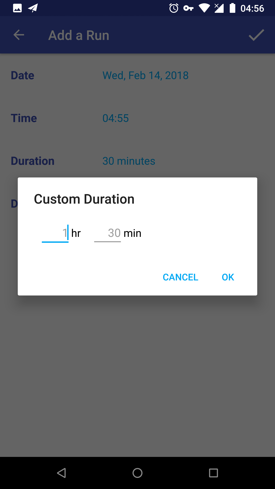

02/14/18: Initiate Commit.

This project is an Android App that records your running and displays them on screen.  

The purpose of this project is to practise SQLite in Android. Therefore, `Contract` class and `SQLiteOpenHelper` are used to help create the SQLite database, and `SQLiteDatabase` handles CRUD of the database, with the help of both `ContentValues` and `Cursor`, without using `ContentProvider` as the project specification requested. 

### Create & Update

1. The initiate page of the app is as above, which is in `CatalogActivity`. users can click the `TextView` in the middle of the screen or press the add icon in the AppBar, which both intent to `EditorActivity` to let users enter data to database.
2. It's also a empty view of the app. Whenever the list items is all clear, the empty view will show up.

1. This is the editor in `EditorActivity`, where users can input the date, time, duration and distance of the run. users can get here by clicking the empty view, press the add icon in AppBar, and clicking each item which will show below.
2. After finishing the editing, press the tick icon in AppBar will close this activity and save data to database through `SQLiteDatabase`. From SQLite database's perspective, the action can be create a new database and add a new row, or update a row of data.
3. When `EditorActivity` is open by `Intent`, it will get the extras variables and set them to the editor fields.

 

1. The entrance of the date and time editor is two different `TextView`. And the date and time the app got save in String formatted by `SimpleDateFormat`.
2. When users click the date views, the app pops up a `DatePickerDialog` in `DatePickerFragment`; on the other hand, when users click the time view, the `TimePickerDialog` in `TimePickerFragment` pops up. Both dialog default date and time are up-to-date.

 

1. The entrance of the duration editor is also a `TextView`. When users click the duration view, the app pops up a single-choice list `AlertDialog` which let users select a preset duration.
2. If users want to enter a custom duration, press "custom..." and a simple `AlertDialog` with `EditText` will pop up, allows users input duration.
3. The hour scale of custom duration is set from 1 to 24, and the minute scale set from 1 to 59, by implementing `InputFilter`.

1. The distance of the run can be entered from `EditText` with a scale of 1 to 100 and maximum length 4 including decimal separator. The input limitation comes from the same helper method as the custom duration editor by implementing `InputFilter`.
2. users can select the distance unit from `Spinner` and the selection will be saved to `SharedPreferences`. Apparently, whenever `EditorActivity` comes on screen, the state of the distance unit `Spinner` will be retrieved from `SharedPreferences` and properly handled. Therefore, the distance unit can be seen as a preference of the app.

### Read

1. The main screen of the app displays a `RecyclerView` list of running records with the distance (w/ unit) on the left, and the date and time in the middle, and finally the duration below the date and time.
2. The distance with its unit displays in two different lines inside a circle. The color of the circle changes according to the distance scales.
3. The date and time display in a specified format by `SimpleDateFormat`.
4. The duration of the run is sensitive to hour/hours and minute/minutes.
5. On the right of each item displays a edit icon, which tells users each item can be clicked and edited.

### Delete

 

In `CatalogActivity` menu, there is a overflow menu with "Delete All Runs" item, as long as users press it, a warning `AlertDialog` will pop up. And if users press "OK", all items in database will be deleted through `SQLiteDatabase`.

 

1. Swipe from right to left on every `RecyclerView` item to remove the cooresponding item by implementing `RecyclerItemTouchHelper` and its `RecyclerItemTouchHelperListener`.
2. After the swipe gesture, the app will pop up a `Snackbar` that tells users the deletion result. The items are set to that it can be consecutively removed.
2. If users want to restore the deleted item, they can press the "UNDO" button in `Snackbar` if it's in time. And the item will be displayed back to the list with the original position.

The app saves all the necessary viarables in `onSaveInstanceState` and retrieves them in `onCreate` and handles properly. Therefore, the app supports both portrait and landscape mode, it will not lose states when device rotates.

The app has adaptive icon, which takes advantages of new features of Android 8.0 (API level 26).

This is a training project in Udacity's Android Basics Nanodegree program.
Check out this and other courses here: https://www.udacity.com/courses/all